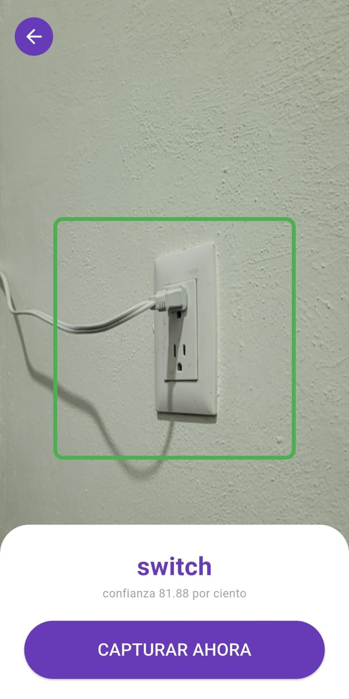
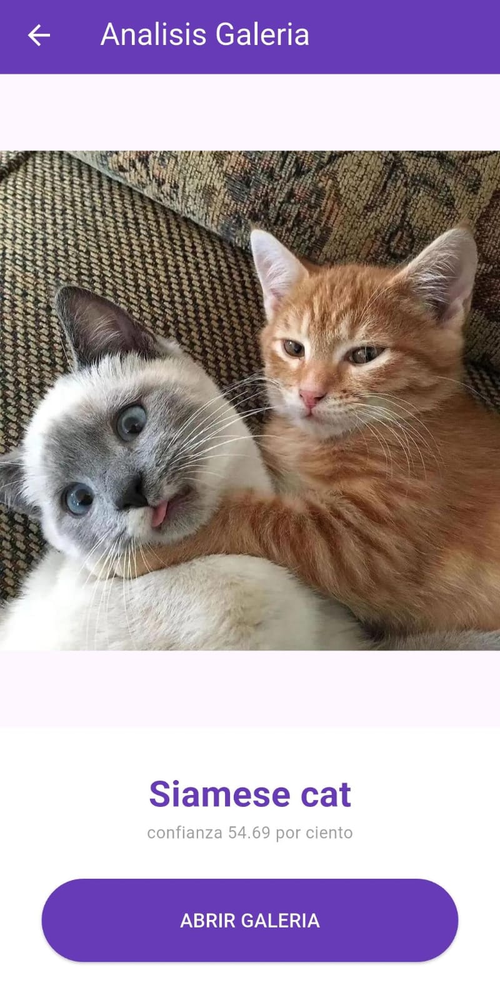

# Clasificador de Imagenes TFLite

Este proyecto consiste en una aplicacion movil desarrollada en Flutter que implementa inteligencia artificial para identificar objetos mediante la camara del dispositivo o imagenes de la galeria. El sistema utiliza modelos optimizados para ejecucion en arquitecturas moviles de alto rendimiento.

### Tecnologias

    - Flutter: Framework para la interfaz de usuario.

    - TFLite Flutter: Motor para ejecutar el modelo de IA.

    - Camera: Control del hardware de captura de video.

    - Image: Procesamiento y redimensionamiento de pixeles.

    - Logger: Registro de eventos y depuracion de errores.

### Problemas y Soluciones

Durante el desarrollo se presentaron los siguientes inconvenientes tecnicos que fueron resueltos para garantizar la estabilidad en Android:

    ##### Error de carga del modelo (Compresion)

    Problema: Android comprimia el archivo .tflite al generar el APK lo que impedia que el interprete lo leyera.

    Solucion: Se modifico el archivo build.gradle añadiendo aaptOptions con la instruccion noCompress para las extensiones tflite y lite.

    ##### Error de arquitectura nativa (NDK)

    Problema: Conflictos entre las librerias nativas de 32 y 64 bits al ejecutar en diferentes procesadores.

    Solucion: Se configuraron los abiFilters en el archivo gradle para limitar el soporte a las arquitecturas compatibles con la libreria de tensorflow.

    ##### Permisos de hardware

    Problema: La aplicacion se cerraba al intentar abrir la camara por falta de privilegios.

    Solucion: Se añadio la etiqueta de uses-permission para la camara en el archivo AndroidManifest.xml para solicitar el acceso correctamente al usuario.

Modelo descargable de: 

https://github.com/emgucv/models/tree/master/mobilenet_v1_1.0_224_float_2017_11_08

